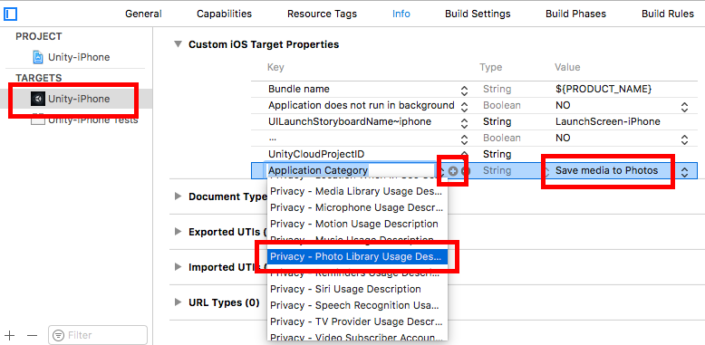

# Unity Native Share Plugin

**Available on Asset Store:** https://www.assetstore.unity3d.com/en/#!/content/112731

**Forum Thread:** https://forum.unity.com/threads/native-share-for-android-ios-open-source.519865/

This plugin helps you natively share files (images, videos, documents, etc.) and/or plain text on Android & iOS. A **ContentProvider** is used to share the media on Android. 

You can set the plugin up in a few easy steps:

- Import **NativeShare.unitypackage** to your project
- *for iOS*: enter a **Photo Library Usage Description** in Xcode



- *for iOS*: also enter a **Photo Library Additions Usage Description**, if exists (see: https://github.com/yasirkula/UnityNativeGallery/issues/3)

- *for Android*: using a ContentProvider requires a small modification in AndroidManifest. If your project does not have an **AndroidManifest.xml** file located at **Assets/Plugins/Android**, you should copy Unity's default AndroidManifest.xml from *C:\Program Files\Unity\Editor\Data\PlaybackEngines\AndroidPlayer* (it might be located in a subfolder, like '*Apk*') to *Assets/Plugins/Android* ([credit](http://answers.unity3d.com/questions/536095/how-to-write-an-androidmanifestxml-combining-diffe.html)).

- Inside the `<application>...</application>` tag of your AndroidManifest, insert the following code snippet:

```xml
<provider
  android:name="com.yasirkula.unity.UnitySSContentProvider"
  android:authorities="MY_UNIQUE_AUTHORITY"
  android:exported="false"
  android:grantUriPermissions="true" />
```

- Here, you should change **MY_UNIQUE_AUTHORITY** with a **unique string**. That is important because two apps with the same **android:authorities** string in their `<provider>` tag can't be installed on the same device. Just make it something unique, like your bundle identifier, if you like.

## Upgrading From Previous Versions
Delete *Plugins/NativeShare.cs*, *Plugins/Android/NativeShare.jar* and *Plugins/iOS/NativeShare.mm* before upgrading the plugin.

## How To
Simply create a new **NativeShare** object and customize it by chaining the following functions as you like (see example code):

- `SetSubject( string subject )`: sets the subject (primarily used in e-mail applications)
- `SetText( string text )`: sets the shared text. Note that the Facebook app will omit text, if exists (see [this topic](https://stackoverflow.com/a/35102802/2373034))
- `AddFile( string filePath, string mime = null )`: adds the file at path to the share action. You can add multiple files of different types. The MIME of the file is automatically determined if left null; however, if the file doesn't have an extension and/or you already know the MIME of the file, you can enter the MIME manually. MIME has no effect on iOS
- `SetTitle( string title )`: sets the title of the share dialog on Android platform. Has no effect on iOS

Finally, calling the **Share()** function of the NativeShare object will do the trick!

## Example Code
The following code captures the screenshot of the game whenever you tap the screen, saves it in a temporary path and then shares it:

```csharp
void Update()
{
	if( Input.GetMouseButtonDown( 0 ) )
		StartCoroutine( TakeSSAndShare() );
}
	
private IEnumerator TakeSSAndShare()
{
	yield return new WaitForEndOfFrame();

	Texture2D ss = new Texture2D( Screen.width, Screen.height, TextureFormat.RGB24, false );
	ss.ReadPixels( new Rect( 0, 0, Screen.width, Screen.height ), 0, 0 );
	ss.Apply();

	string filePath = Path.Combine( Application.temporaryCachePath, "shared img.png" );
	File.WriteAllBytes( filePath, ss.EncodeToPNG() );

	new NativeShare().AddFile( filePath ).SetSubject( "Subject goes here" ).SetText( "Hello world!" ).Share();
}
```

## Known Limitations
- Gif files are shared as static images on iOS
